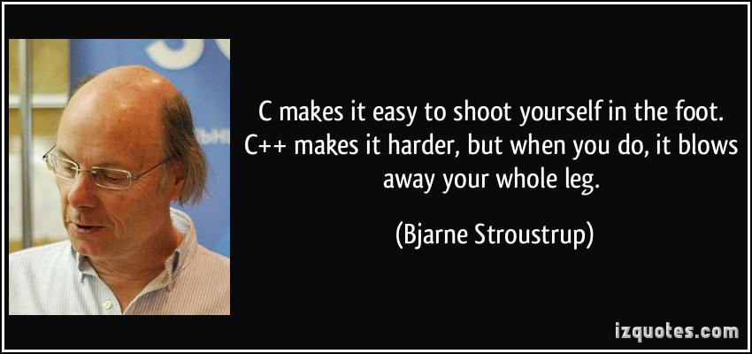

# Rust as an alternative to C and C++


## Use-After-Free
```c++
#include <iostream>
#include <string>

class Dog {
    std::string mName;
public:
    Dog(const char* name) {
        mName = std::move(name);
    }

    void bark() {
        std::cout << "Wuff!" << std::endl;
    }
};

int main() {
    Dog *snuffles = new Dog("Snuffles");

    delete snuffles; // RIP
    
    snuffles->bark();
}
```

## Buffer overflow
```c++
#include <iostream>
#include <cstring>

int main() {
    int auth = 0;
    char password[10];
    std::cout << "Password: ";
    std::cin >> password;

    if (strcmp(password, "secret!") == 0) {
        auth = 1;
    } else {
        std::cout << "Wrong password!" << std::endl;
    }

    if (auth) {
        std::cout << "Logged in!" << std::endl;
    }
}
```

## Type Safe Languages
> Practitioners who invented type safety often meant just **“memory integrity”**, while theoreticians always meant **“execution integrity”**, and it is the latter that seems more relevant now
* Static and runtime checks
* Array bounds checking
* Garbage collection

# What is Rust?

## Goals
> Take, for example, **“systems-level” work** that deals with low-level details of **memory management, data representation, and concurrency**. Traditionally, this realm of programming is seen as arcane, accessible only to a select few who have devoted the necessary years learning to **avoid its infamous pitfalls**. And even those who practice it do so with caution, lest their code be open to **exploits, crashes, or corruption**.
* Eliminate pitfalls
* Friendly and polished set of tools
* "Dip down" into lower level, **without** taking unnecessary risks of crashes and **security holes**
* Reliable, efficient and memory efficient code
* Low risk parallelism
* Coding **with** the compiler and not against it

## Domain
* System programming (Drivers, Operating systems, etc.)
* Embedded systems
* Compiler
* Browser
* Multimedia (Codecs etc.)
* **Web Servers**
* **Business Applications**

## History
* 2006 Personal project of Mozilla employee Graydon Hoare
* 2009 Mozilla began sponsoring the project
* 2011 Rust compiler compiled itself
* 2012 Pre-Alpha release
* 2015 First stable release

## Ecosystem
* Open-Source  
TODO

## Hello World
```rust
fn main() {
    println!("Hello, world!");
}
```
```sh
cargo new hello_world
cd hello_world
cargo run
```

# Agenda
* Introduction
* Ownership and borrowing
* Avoiding pitfalls of C/C++
* Structs and enums
* Traits
* Structuring in Rust
* OOP in rust
* Integrating C/C++ libraries into Rust
* Application: Messageboard using Rocket

# Ownership
> Ownership is Rust’s most unique feature, and it enables Rust to make memory safety guarantees without needing a garbage collector.  
> 1. Each value in Rust has a variable that’s called its owner.
> 2. There can only be one owner at a time.
> 3. When the owner goes out of scope, the value will be dropped.

## Stack vs. Heap


## Example: C++ vs. Rust
### C++: dog2 is an alias for dog1
```c++
int main() {
    std::string *dog1 = new std::string("Snuffels");
    std::string *dog2 = dog1;

    std::cout << "Dog 1: " << *dog1 << " (" << &dog1 << ") " << std::endl;
    std::cout << "Dog 2: " << *dog2 << " (" << &dog2 << ") " << std::endl;

    delete dog1;
}
```


### Rust: dog2 takes ownership of dog1 (Similar to Resource Acquisition Is Initialization (RAII))
```rust
fn main() {
    let dog1 = String::from("Snuffles");
    let dog2 = dog1;

    println!("Dog 1: {} / Dog 2: {}", dog1, dog2);
}
```


### C++: dog2 takes ownership of dog1
```c++
int main() {
    std::string dog1 = "Snuffels";
    std::string dog2 = std::move(dog1);

    std::cout << "Dog 1: " << dog1 << " (" << &dog1 << ") " << std::endl;
    std::cout << "Dog 2: " << dog2 << " (" << &dog2 << ") " << std::endl;
}
```

## Functions
```rust
fn say_name(name: String) {
    prinln!("{}", name);
}

fn main() {
    let name = String::from("Snuffles");
    say_name(name);
    println!("say_name was called with: {}", name);
}
```

```c++
void say_name(std::string &&name) {
    std::cout << name << std::endl;
}

int main() {
    std::string *dog1 = new std::string("Snuffels");
    std::string *dog2 = dog1;

    say_name(std::move(*dog1));
    say_name(std::move(*dog2));

    std::cout << "Dog 1: " << *dog1 << " (" << &dog1 << ") " << std::endl;
    std::cout << "Dog 2: " << *dog2 << " (" << &dog2 << ") " << std::endl;

    delete dog1;
}
```

# References & Borrowing
> * At any given time, you can have either one mutable reference or any number of immutable references.
> * References must always be valid.

## Passing a variable to a function without loosing ownership
```rust
fn calculate_length(s: &String) -> usize {
    s.len()
}

fn main() {
    let s1 = String::from("hello");

    let len = calculate_length(&s1);

    println!("The length of '{}' is {}.", s1, len);
}
```


## Explicit mutability instead of implicit mutability
```rust
fn main() {
    let mut s = String::from("hello");

    change(&mut s);
}

fn change(some_string: &mut String) {
    some_string.push_str(", world");
}

```

## Either one mutable refrence or many immutable references
### Prevent data races at compile time!
```rust 
fn main() {
    let mut s = String::from("hello");

    let r1 = &mut s;
    let r2 = &mut s;

    println!("{}, {}", r1, r2);
}
```

### Anyone who is reading a value would not expect the value to suddenly change
```rust
fn main() {
    let mut s = String::from("hello");

    let r1 = &s; // no problem
    let r2 = &s; // no problem
    let r3 = &mut s; // BIG PROBLEM

    println!("{}, {}, and {}", r1, r2, r3);
}
```

## Dangling References
### C++: Will compile just fine
```c++
int main() {
    int *answer;
    {
        int calc_answer = 2*3*7;
        answer = &calc_answer;
    }
    std::cout << "Address of answer: " << answer << std::endl;
    std::cout << "Answer is: " << *answer << std::endl;
}
```

### Rust: Will complain during compilation
```rust
fn dangle() -> &String {
    let s = String::from("hello");
    &s
}

fn main() {
    let reference_to_nothing = dangle();
}
```


# Sources
* https://www.rust-lang.org/
* https://en.wikipedia.org/wiki/Rust_(programming_language)
* https://github.com/rust-lang/book
* https://techdifferences.com/difference-between-stack-and-heap.html